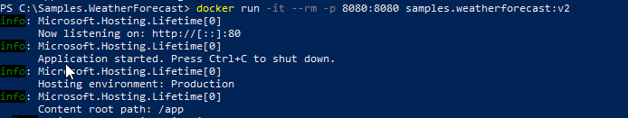
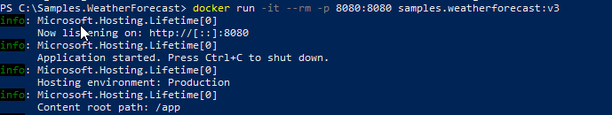
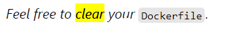

# Samples.WeatherForecast

https://dev.to/newday-technology/api-s-from-dev-to-production-428i 

## Step 1

Followed steps as listed (using commands in cmd/powershell, vscode ui for git), encountered issues below

Issues : 
1. Was unable to update "Swashbuckle.AspNetCore" as it was not located in my offline packages or in the Valocity package set. Had to add nuget as a package source to get the last version to allow a successful 'dotnet restore'
2. Was unable to build the docker file from the root folder. Turns out that docker actually has to be running, so I opened the Docker Desktop app and tried again
3. Was unable to successfully send a postman get request. Make sure to send it to http instead of https (I guess there is some set up required for https to work, porbably authentication?)

## Step 2

Followed steps as listed and encountered no issues until I tried to send a postman request. Definitely more reading and thinking (and googling) than writing in this section

Issues :
1. Was unable to successfully send a postman get request: As covered in the read-me's of https://github.com/johannesprinz/Samples.WeatherForecast and https://github.com/henrymrrtt67/Sample.WeatherForecast, it seems like we were exposing the 8080 port in the dockerfile but that was not not the actual port we were sitting in (which was 80, as it seems that is the default). By adding ENV ASPNETCORE_URLS=http://+:8080 to the docker file we are able to make sure the exposed port is the same as the url the api is listening on

Before:

After:

## Step 3

Followed steps as listed and encountered no big issues. Only thing to take note of is I enabled improved container support (User Icon -> Feature Preview), not really sure if it helped but it can't hurt right? Also had the permissions issues when trying to pull the docker image, but the steps cover how to solve that

## Step 4

Followed steps as listed and only encountered one issue, due to a type in the steps.

Issues :
1. Got the following error while building docker image - 'unable to convert uid/gid chown string to host mapping: can't find gid for group dotnetgroup: no such group: dotnetgroup'. Fixed by using the correct code (use COPY --chown=dotnet:dotnet --from=publish /out . not COPY --chown=dotnet:dotnetgroup --from=publish /out .)

## Step 5

Followed steps as listed and encounter no issues

Set up basic health checks in the dockerfile and the Startup file

## Step 6

Followed steps as listed, but had some issues. No issues when it came to setting up the unit test aspects of the docker file, but my issuse came with adapting the current commands so that you could still create a docker image for the api. 

This line suggested to me to remove all current code in the dockerfile, and to start replacing the code with the code from the future sections. The issue is the future sections outlined how to correctly add the new unit testing code, but it didnt mention not to remove the current code or how to adapt the current code to be usable now that we have added the unit testing code. After a bit of confusion on how to get the two sections to work to together, I ending up having to go to the ready-made section 6 repository and copy from that docker file.

## Step 7

In this step we added code coverage to our repository using coverlet and codecov

Did not have any issues with this step, just followed the steps. 

## Step 7

In this step we added code coverage to our repository using coverlet and codecov

Did not have any issues with this step, just followed the steps. 

## Step 8

In this step we added a new CI step to allow us to check test coverage for pull requests

Did not have any issues with this step, just followed the steps. 

